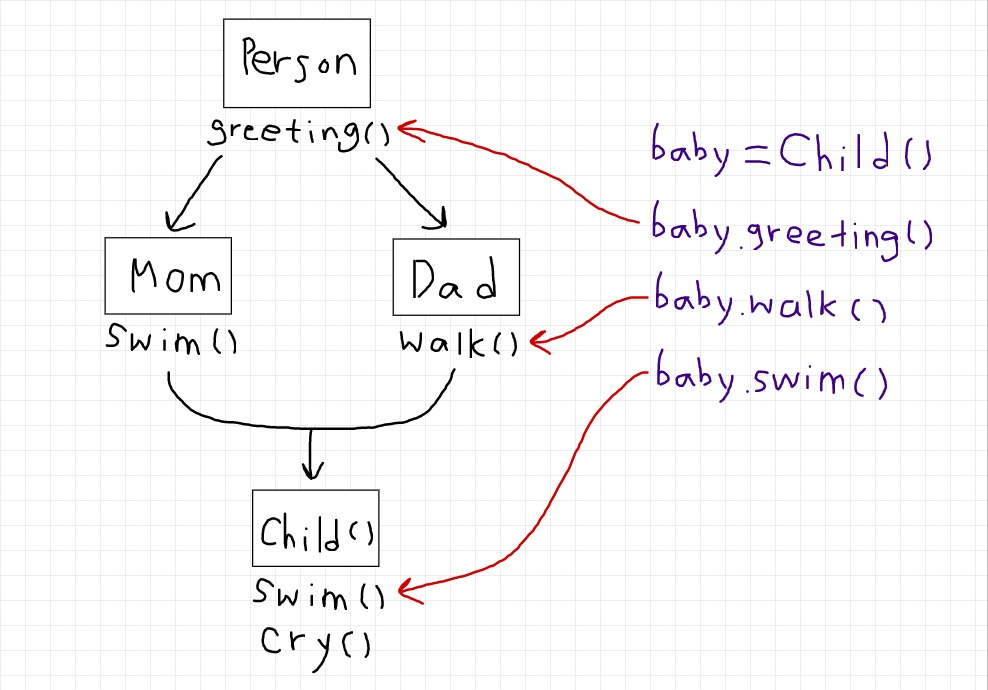

### 목차

- [06_module](#06_module)
  * [from 모듈 import 데이터 as 별명](#from--import--as-)
- [07_OOP](#07_oop)
  * [매직 메서드](#-)
  * [인스턴스 메서드, 클래스 메서드, 스태틱 메서드](#-----)
  * [상속](#)

<br>

## 06_module

### from 모듈 import 데이터 as 별명

```python
# my_package/statistics/tools.py
import math

def standard_deviation(values):
    mean = sum(values) / len(values)
    sum_var = sum(pow(value - mean, 2) for value in values) / len(values)
    std_dev = math.sqrt(sum_var)
    return std_dev

# import_example.py
from my_package.statistics.tools import standard_deviation as sd
print(sd([2, 3, 4]))
```

- tools.py 파일에서 `import math` 해줘야 오류 안 남!
- `import`는 var, function, Class 모두 가능


## 07_OOP

### 매직 메서드

```python
class Person:
    def __init__(self, name, age):
        self.name = name
        self.age = age
    
    # greater than
    def __gt__(self, other):
        return self.age > other.age
    # equal
    def __eq__(self, other):
        return self.age == other.age
    
p1 = Person('yj', 24)
p2 = Person('hj', 31)
p3 = Person('de', 24)

print(p1 > p2)
# False
print(p1 == p3)
# True
```


### 인스턴스 메서드, 클래스 메서드, 스태틱 메서드

```python
class MyClass:
    # 인스턴스 메서드가 디폴트!
    # 호출 시 첫 인자로 인스턴스 자기 자신이 전달됨
    # 메서드 내에서 self.~ 형태로 인스턴스 변수 이용
    def instance_method(self):
        return self
    
    # 인스턴스 말고 클래스 쓰고 싶을 때 사용
    # 메서드 내에서 cls.~ 형태로 클래스 변수 이용
    # 밖에서 호출할 땐 클래스명.class_method() 형태로 사용
    @classmethod
    def class_method(cls):
        return cls
    
    # 인스턴스, 클래스 메서드 둘 다 안 쓰고 싶을 때 사용
    @staticmethod
    def static_method(arg):
        return arg

```


### 상속

- 메서드 오버라이딩
  - 상속 받은 메서드를 재정의 -> 덮어쓰는 것!
  - 파이썬에는 메서드 오버로딩(이름은 같고 매개변수/타입 다르게 하는 식으로 메서드 여러 개 작성) 없음!
- 상속관계에서의 이름 공간
  - 인스턴스 -> 자식 메서드 -> 부모 메서드 순으로 탐색

- 다중 상속
  - 두 개 이상의 클래스를 상속받는 경우(ex. `class Baby(Mom, Dad)`), 중복된 속성/메서드 사용 시 상속 순서에 의해서 결정



