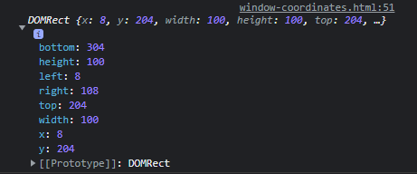

## Web API

### Size

- `window.screen.width` & `window.screen.height`
  - 툴바, 작업표시줄을 포함하는 모니터 전체 사이즈
  - 창을 resizing 해도 변하지 않는다.

- `window.outerWidth` & `window.outerHeight`
  -  툴바를 포함하는 브라우저 전체 사이즈
  - padding, border를 포함한다. (margin은 선택적으로 포함 가능)
- `window.innerWidth` & `window.innerHeight`
  -  툴바를 제외한 브라우저의 사이즈
  - 스크롤바를 포함한다.
  - padding을 포함한다.
- `document.documentElement.clientWidth` & `document.documentElement.clientHeight`
  - 스크롤바를 제외한 문서 자체의 사이즈


### Coordinates

#### 좌표를 구하는 방법

1. `Element.getBoundingClientRect()`

   이 메서드는 `left`, `top`, `right`, `bottom`, `x`, `y`, `width`, `height` 프로퍼티를 갖는 `DOMRect` 객체를 반환한다.

   

2. `MouseEvent.clientX` & `MouseEvent.clientY`

   현재 viewport 내에서 이벤트가 발생한 위치의 x, y 좌표를 제공한다.

3. `MouseEvent.pageX` & `MouseEvent.pageY`

   전체 문서를 기준으로 이벤트가 발생한 위치의 x, y 좌표를 제공한다.

   즉, Y축을 기준으로 200px만큼 스크롤을 내린 상태에서 viewport 상으로 (100, 100) 위치를 클릭했다면 `pageX`의 값은 300이 된다. 현재 화면에 보이지 않는 부분을 포함하여 좌표가 결정되는 것이다.


#### 스크롤 방법

1. `window.scrollBy()`

   지정한 값만큼 스크롤한다.

2. `window.scrollTo()`

   지정한 좌표 위치로 스크롤한다.

3. `Element.scrollIntoView()`

   메서드를 호출한 요소가 표시되도록 스크롤한다.


### Load

```html
<!DOCTYPE html>
<html lang="en">
  <head>
    <meta charset="UTF-8" />
    <meta http-equiv="X-UA-Compatible" content="IE=edge" />
    <meta name="viewport" content="width=device-width, initial-scale=1.0" />
    <title>window load</title>
    <!-- 1 -->
    <script src="test.js" defer></script>
  </head>
  <body>
    <script>
      // 2
      window.addEventListener("DOMContentLoaded", () => {
        console.log("DOMContentLoaded");
      });
      // 3
      window.addEventListener("load", () => {
        console.log("load");
      });
      // 4
      window.addEventListener("beforeunload", () => {
        console.log("beforeunload");
      });
      // 5
      window.addEventListener("unload", () => {
        console.log("unload");
      });
    </script>
  </body>
</html>
```

- `defer` 속성을 가진 스크립트, `DOMContentLoaded` 이벤트, `load` 이벤트의 순서는 아래와 같다.

  

1. `defer` 속성을 가진 스크립트

   HTML 파싱을 마치고 DOM이 준비된 후, `DOMContentLoaded` 이벤트가 발생하기 전에 실행된다.

2. `DOMContentLoaded` 이벤트

   HTML 파싱을 마쳤을 때 발생한다.

3. `load` 이벤트

   css, 이미지를 포함한 모든 리소스들의 로딩이 완료되었을 때 발생한다.

4. `beforeunload` 이벤트

   문서와 리소스가 언로드 되기 직전에 발생한다.

5. `unload` 이벤트

   문서와 리소스가 언로드 중일 때 발생한다.

